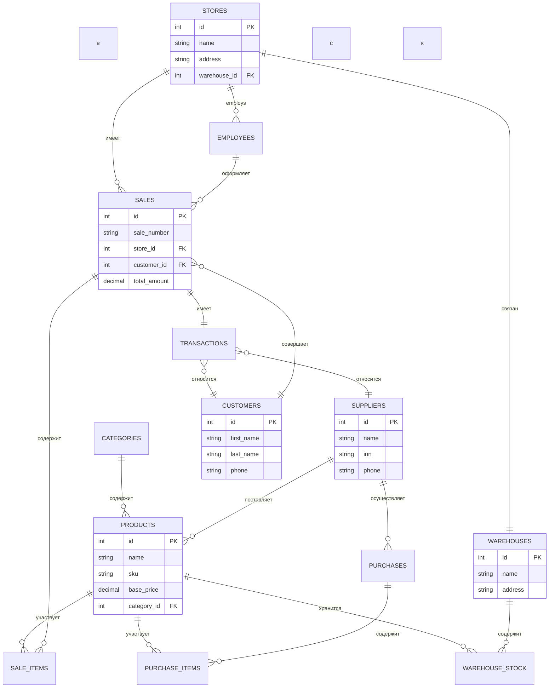

# Матрица связей БД: Система управления розничной торговлей

## Сущности базы данных

| № | Сущность | Описание |
|---|----------|----------|
| 1 | **Products** (Товары) | Каталог товаров с характеристиками |
| 2 | **Suppliers** (Поставщики) | Информация о поставщиках товаров |
| 3 | **Stores** (Магазины) | Торговые точки розничной сети |
| 4 | **Customers** (Покупатели) | Клиенты розничной сети |
| 5 | **Sales** (Продажи) | Заголовки документов продаж |
| 6 | **SaleItems** (Строки продаж) | Позиции в документах продаж |
| 7 | **Warehouses** (Склады) | Складские помещения |
| 8 | **WarehouseStock** (Складские запасы) | Остатки товаров на складах |
| 9 | **Purchases** (Закупки) | Заголовки документов закупок |
| 10 | **PurchaseItems** (Строки закупок) | Позиции в документах закупок |
| 11 | **Categories** (Категории) | Категории товаров |
| 12 | **Employees** (Сотрудники) | Персонал магазинов и складов |
| 13 | **Transactions** (Финансовые транзакции) | Финансовые операции |

---

## Матрица связей

| От | К | Тип связи | Описание |
|----|---|-----------|----------|
| **Products** | Categories | M:1 | Товар принадлежит категории |
| **Products** | Suppliers | M:M | Товар может поставляться несколькими поставщиками |
| **Products** | WarehouseStock | 1:M | Товар хранится на складе в нескольких партиях |
| **Products** | SaleItems | 1:M | Товар участвует во многих продажах |
| **Products** | PurchaseItems | 1:M | Товар участвует во многих закупках |
| **Suppliers** | Products | M:M | Поставщик поставляет множество товаров |
| **Suppliers** | Purchases | 1:M | Поставщик является источником закупок |
| **Suppliers** | Transactions | 1:M | Поставщик участвует в финансовых операциях |
| **Stores** | Employees | 1:M | В магазине работает много сотрудников |
| **Stores** | Sales | 1:M | В магазине совершается много продаж |
| **Stores** | Warehouses | 1:1 | Магазин привязан к складу |
| **Customers** | Sales | 1:M | Покупатель совершает много покупок |
| **Customers** | Transactions | 1:M | Покупатель участвует в финансовых операциях |
| **Sales** | SaleItems | 1:M | Продажа содержит много позиций товаров |
| **Sales** | Stores | M:1 | Продажа совершается в магазине |
| **Sales** | Customers | M:1 | Продажа принадлежит покупателю |
| **Sales** | Employees | M:1 | Продажа оформляется сотрудником |
| **Sales** | Transactions | 1:1 | Продажа связана с финансовой транзакцией |
| **SaleItems** | Sales | M:1 | Позиция принадлежит продаже |
| **SaleItems** | Products | M:1 | Позиция содержит товар |
| **Warehouses** | WarehouseStock | 1:M | На складе хранится много остатков |
| **Warehouses** | Stores | 1:1 | Склад привязан к магазину |
| **WarehouseStock** | Warehouses | M:1 | Остаток принадлежит складу |
| **WarehouseStock** | Products | M:1 | Остаток относится к товару |
| **Purchases** | Suppliers | M:1 | Закупка у поставщика |
| **Purchases** | PurchaseItems | 1:M | Закупка содержит много позиций |
| **Purchases** | Warehouses | M:1 | Закупка поступает на склад |
| **PurchaseItems** | Purchases | M:1 | Позиция принадлежит закупке |
| **PurchaseItems** | Products | M:1 | Позиция содержит товар |
| **Employees** | Stores | M:1 | Сотрудник работает в магазине |
| **Employees** | Sales | 1:M | Сотрудник оформляет продажи |
| **Transactions** | Sales | 1:1 | Транзакция по продаже |
| **Transactions** | Purchases | 1:1 | Транзакция по закупке |
| **Transactions** | Customers | M:1 | Транзакция покупателя |
| **Transactions** | Suppliers | M:1 | Транзакция поставщику |
| **Categories** | Products | 1:M | Категория содержит товары |

---

## Детальное описание сущностей

### 1. Products (Товары)
```
- id (PK)
- name
- sku (артикул)
- description
- base_price
- cost_price
- quantity_unit (шт, кг, л)
- barcode
- category_id (FK)
- min_stock_level
- max_stock_level
- is_active
- created_at
- updated_at
```

### 2. Suppliers (Поставщики)
```
- id (PK)
- name
- inn (ИНН)
- kpp (КПП)
- legal_address
- phone
- email
- contact_person
- payment_terms
- rating
- is_active
- created_at
```

### 3. Stores (Магазины)
```
- id (PK)
- name
- code
- address
- phone
- email
- manager_id (FK)
- warehouse_id (FK)
- working_hours
- is_active
- created_at
```

### 4. Customers (Покупатели)
```
- id (PK)
- first_name
- last_name
- phone
- email
- loyalty_points
- discount_card_number
- registration_date
- last_purchase_date
- is_active
```

### 5. Sales (Продажи)
```
- id (PK)
- sale_number
- store_id (FK)
- customer_id (FK)
- employee_id (FK)
- sale_date
- total_amount
- discount_amount
- tax_amount
- payment_method
- status
- created_at
```

### 6. SaleItems (Строки продаж)
```
- id (PK)
- sale_id (FK)
- product_id (FK)
- quantity
- unit_price
- discount
- tax_rate
- total_amount
```

### 7. Warehouses (Склады)
```
- id (PK)
- name
- code
- address
- store_id (FK)
- capacity
- manager_id (FK)
- is_active
- created_at
```

### 8. WarehouseStock (Складские запасы)
```
- id (PK)
- warehouse_id (FK)
- product_id (FK)
- quantity
- reserved_quantity
- batch_number
- expiry_date
- last_updated
```

### 9. Purchases (Закупки)
```
- id (PK)
- purchase_number
- supplier_id (FK)
- warehouse_id (FK)
- purchase_date
- expected_date
- total_amount
- status
- received_date
- created_at
```

### 10. PurchaseItems (Строки закупок)
```
- id (PK)
- purchase_id (FK)
- product_id (FK)
- quantity_ordered
- quantity_received
- unit_cost
- total_cost
```

### 11. Categories (Категории)
```
- id (PK)
- name
- parent_id (FK, self-reference)
- description
- sort_order
- is_active
```

### 12. Employees (Сотрудники)
```
- id (PK)
- first_name
- last_name
- phone
- email
- store_id (FK)
- position
- hire_date
- salary
- is_active
```

### 13. Transactions (Финансовые транзакции)
```
- id (PK)
- transaction_number
- transaction_type (sale, purchase, refund)
- sale_id (FK, nullable)
- purchase_id (FK, nullable)
- customer_id (FK, nullable)
- supplier_id (FK, nullable)
- amount
- currency
- payment_method
- status
- transaction_date
- created_at
```

---

## Диаграмма связей (Mermaid)



---

## Бизнес-правила

1. **Товар** должен принадлежать хотя бы одной **категории**
2. **Продажа** должна быть привязана к **магазину** и **сотруднику**
3. **Покупатель** может быть анонимным (nullable в Sales)
4. **Складской остаток** не может быть отрицательным
5. **Закупка** должна быть привязана к **поставщику** и **складу**
6. **Финансовая транзакция** связана либо с продажей, либо с закупкой
7. **Сотрудник** работает только в одном **магазине**
8. **Склад** привязан только к одному **магазину**
